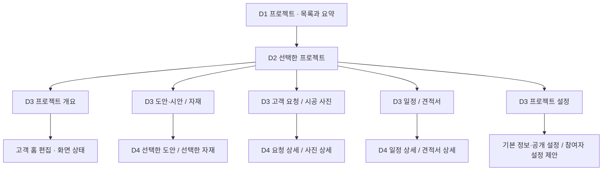
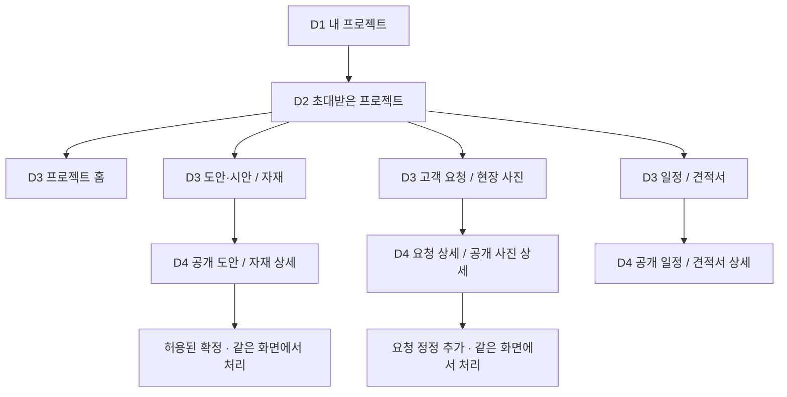
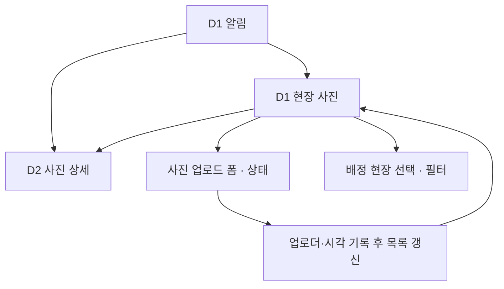

# 인테리어 플랫폼 뎁스·화면 구조 제안

기준: 2차설계안수정9.16.pdf에서 노란 표시를 제외한 요구사항과 사용자의 최신 삭제 지시.
상태: 팀 검토 후 2026.09.17 요청 3건 반영. 기존 뎁스와 미결정 사항은 유지하며, 실제 서비스 구현 완료를 의미하지 않는다.

## 1. 구조의 원칙

핵심 구조는 **업무 메뉴(D1) → 프로젝트(D2) → 기능 탭(D3) → 개별 항목(D4)**다.
모든 메뉴를 네 단계로 늘리지 않는다. 고객 관리나 사진 상세는 두 단계로 끝날 수 있다.

| 구분 | 뜻 | 예시 |
|---|---|---|
| 영역 D0 | 사용하는 서비스 환경. 뎁스 계산에서 제외 | 디자이너, 고객, 시공팀 |
| D1 | 그 영역에서 항상 찾을 수 있는 주요 업무 메뉴 | 프로젝트, 고객 관리, 전체 캘린더 |
| D2 | 업무 대상 또는 하위 설정 분류 | 특정 프로젝트, 특정 고객 |
| D3 | 프로젝트 내부 기능 분류 | 도안·시안, 자재, 고객 요청 |
| D4 | 독립적으로 조회·공유할 개별 항목 | 특정 자재 상세, 특정 고객 요청 |
| 동작·상태 | 해당 화면에서 하는 일. 별도 뎁스로 계산하지 않음 | 등록, 수정, 확정, 업로드, 필터, 오류 |

예: `프로젝트 > 강남 A현장 > 자재 > 욕실 타일`은 D4다.
여기서 ‘수정’을 눌러 폼을 열어도 D5를 만들지 않는다.
직접 링크로 D4에 들어가도 정보계층은 그대로 D4다. 클릭 횟수나 URL 슬래시 수로 뎁스를 세지 않는다.
로그인·초대 수락은 공통 진입 절차이며 모든 메뉴의 부모가 아니다.

**배치 원칙:** 업체 전체 업무는 D1, 한 프로젝트의 업무는 D3, 항목 자체의 상세는 D4에 둔다.
요약·바로가기는 다른 곳에 보여도 원본 기능의 위치는 하나다.

## 2. 영역 구분

| 영역 | 시작 화면 | 주소 제안 | 범위 |
|---|---|---|---|
| 디자이너/PM | 프로젝트 목록 | `/app/{company}/projects` | 담당 프로젝트 및 허용된 업체 업무 |
| 고객 | 내 프로젝트 | `/portal/projects` | 초대받은 프로젝트의 공개 내용 |
| 시공팀 | 현장 사진 | `/field/photos` | 배정받은 현장·기간 |

주소는 목표 구조 제안이다. 현재 URL과 다르면 호환·차단·이동 정책을 명시해 전환한다.
디자이너·고객·시공팀 영역은 같은 서비스 도메인에서 경로로 구분한다. 시스템 관리자 영역은 이번 구현 범위에서 보류한다.
URL 분리는 보안 보장이 아니다. 모든 요청에서 계정·업체·역할·프로젝트·기간을 검증한다.
여러 역할이 있는 계정은 허용된 영역만 선택한다. 영역 선택 자체로 권한을 얻지 않는다.

## 3. 디자이너/PM 구조

상단의 고정 업무 메뉴는 `프로젝트 / 고객 관리 / 전체 캘린더 / 변경이력`이다.
`알림`은 공통 버튼으로, `설정`은 오른쪽 보조 메뉴로 둔다. 홈에 모든 업무 폼을 몰아넣지 않는다.
별도 대시보드 메뉴를 만들지 않고 프로젝트 목록 위에 현황 요약만 표시한다.



그림에서 한 상자에 묶인 기능은 각각 별도 탭이다. 예를 들어 도안·시안과 자재는 한 화면이 아니다.

| 화면 ID | 뎁스·위치 | 화면 내용 | 다음 이동·동작 |
|---|---|---|---|
| PM-01 | D1 프로젝트 | 허용 프로젝트 목록, 검색·상태 필터, 간단한 현황 | 선택 → PM-02, 신규 생성은 폼 |
| PM-02 | D2 프로젝트 컨테이너 | 프로젝트명·현장·기간, 공통 탭, 프로젝트 이동 | 기본 탭 PM-03 |
| PM-03 | D3 프로젝트 개요 | 현재 공정, 최근 업데이트, 다음 일정, 고객 홈 미리보기 | 각 상세로 링크, 홈 편집 모드 |
| PM-04 | D3 도안·시안 | SKP·PDF·DWG 도안 파일 목록, 미리보기, 공개 상태, 이미지 비교 | 도안 선택 → PM-14, 업로드 폼(.skp·.pdf·.dwg) |
| PM-05 | D3 자재 | 카테고리·공간 필터, 사양·수량·단가·확정 상태 | 자재 선택 → PM-15 |
| PM-06 | D3 고객 요청 | 요청 목록, 처리 상태, 담당자 답변 여부 | 요청 선택 → PM-16 |
| PM-07 | D3 시공 사진 | 공정·촬영일별 사진, 업로더·공개 상태 | 사진 선택 → PM-17, 다중 업로드 |
| PM-08 | D3 일정 | 전체 기간 타임라인·일요일 시작 월간 캘린더 | 일정 선택 → PM-18, 등록 폼 |
| PM-09 | D3 견적서 | PDF 목록·버전·공개 상태 | 선택 → PM-19, 새 버전 업로드 |
| PM-10 | D3 프로젝트 설정 | 기본 정보·공개 설정, 참여자 관리 위치 제안 | 같은 화면의 구역·폼으로 처리 |
| PM-14 | D4 도안 상세 | 파일, 공개·승인 상태, 비교 이미지 A/B 선택, 좌우 비교 슬라이더 | 두 이미지를 겹쳐 핸들 이동으로 노출 비율 변경. D4 유지. 버전 보존 정책은 별도 결정 |
| PM-15 | D4 자재 상세 | 사양·이미지·수량·단가·적용 위치·확정 기록 | 수정·공개 설정. 구매 진행 단계 없음 |
| PM-16 | D4 요청 상세 | 원문·정정·답변·처리 상태 | 답변·처리 상태 변경 |
| PM-17 | D4 사진 상세 | 원본 정보·촬영일·설명·업로더·공개 여부 | 공개 설정·허용된 수정 |
| PM-18 | D4 일정 상세 | 일시·일정 내용·관련 프로젝트 | 수정·관련 콘텐츠 이동 |
| PM-19 | D4 견적서 상세 | 선택 버전의 PDF·변경 설명·공개 시각 | 미리보기·다운로드·공개 |

여섯 업무 탭은 도안·자재·요청·사진·일정·견적이다. 개요와 설정은 업무 탭과 구분해 배치한다.
모바일에서는 프로젝트 내부 탭을 가로 스크롤 또는 선택 메뉴로 바꾼다. 계층·화면 ID는 동일하다.

### 도안 업로드와 PM-14 이미지 비교 명세

- **도안 원본 업로드 형식:** `.skp`, `.pdf`, `.dwg`. 대소문자를 구분하지 않고 검증하며, 다른 형식의 도안 원본은 허용하지 않는다. 서버에서도 파일 형식·내용·용량을 확인한다.
- **원본과 비교 이미지 구분:** SKP·DWG 원본 자체를 슬라이더에 표시하지 않는다. 해당 도안에 연결된 미리보기 이미지 또는 렌더링 스냅샷을 비교한다. PDF는 선택 페이지의 이미지 미리보기를 사용한다. 이미지 생성·연결 방식은 실제 구현 환경에 맞춰 정하고, CAD 웹 뷰어를 이번에 새로 요구하지 않는다.
- **비교 대상 선택:** PM-14 안에서 A와 B를 선택한다. 접근 가능한 같은 프로젝트의 이미지 중 두 대상을 고르며 이름·연결 도안·PDF 페이지 등 식별 정보를 표시한다. 선택만으로 파일을 수정하거나 승인 상태를 바꾸지 않는다.
- **표시 방식:** 같은 크기의 비교 영역에 두 이미지를 겹치고, 초기 경계는 중앙 50%다. 왼쪽에는 A, 오른쪽에는 B가 보인다. 세로 핸들을 좌우로 움직이면 두 이미지의 노출 면적이 연속적으로 변한다. 이미지가 번갈아 나타나는 캐러셀이나 자동 재생이 아니다.
- **이미지 정렬:** 두 이미지는 고정된 동일 영역에 종횡비를 유지해 배치한다. 핸들 위치에 따라 이미지 크기가 변하지 않고 노출 영역만 달라져야 한다. 비율이 다르면 여백을 허용하며 임의로 늘이거나 잘라 맞추지 않는다.
- **입력:** 마우스·터치 드래그와 키보드 좌우 방향키를 지원한다. A/B 라벨과 현재 비율을 표시한다. 기본 파일 확인은 비교 이미지 없이도 가능하다.
- **예외:** 이미지가 두 개 미만이거나 로딩 실패·접근 불가이면 비교 불가 사유를 표시하고 슬라이더를 비활성화한다. 원본 파일의 권한 있는 다운로드는 유지한다.
- **뎁스:** 이미지 선택과 슬라이더 조작은 PM-14의 화면 상태다. 새 탭·메뉴·D5를 만들지 않는다. 고객에게 공개되는 비교는 두 대상 모두 공개된 경우에만 허용한다.
- **검증:** 0%에서 B 전체, 50%에서 A/B 절반, 100%에서 A 전체가 보이는지 확인한다. 드래그 중 이미지 크기가 바뀌지 않는지, 모바일·키보드에서도 조작 가능한지 확인한다.

HTML 구조도에는 위 동작을 확인할 수 있는 **설명용 샘플 이미지 슬라이더**를 넣었다. 실제 SKP·DWG 변환이나 서버 업로드 기능을 구현한 것은 아니다.

### 프로젝트 밖에 둘 업무

| 화면 ID | D1 | D2 | D3·D4 여부 | 경계 |
|---|---|---|---|---|
| PM-20/21 | 고객 관리 | 고객 상세 | 없음 | 연락처와 관련 프로젝트 목록. 프로젝트 업무는 원본 화면으로 이동 |
| PM-30 | 전체 캘린더 | 없음 | 일정 클릭 시 PM-18로 이동 | 허용 프로젝트의 일정을 합쳐 보여주는 조회 창 |
| PM-40/41 | 변경이력 | 변경기록 상세 | 없음 | 조회 권한 범위 안에서 필터·전후 값 확인 |
| PM-50 | 알림 | 없음 | 대상 화면으로 직접 이동 | 알림 자체를 업무 편집 화면으로 만들지 않음 |
| PM-60/61~64 | 설정 | 업체 정보 / 구성원 / 기본 템플릿 / 저장공간 | 필요한 편집은 폼 | 아래 권한 제안 승인 후 활성화 |

설정에는 남은 요구사항만 배치한다. 요금제·결제 메뉴, 별도 업체 총관리자 콘솔은 만들지 않는다.
계정 비밀번호 재설정은 로그인 보조 흐름을 사용한다. 삭제된 고객 마이페이지를 설정이라는 이름으로 되살리지 않는다.
업체 설정 내 알림 정책과 고객 개인 알림 설정은 별개다. 후자는 존치 여부 결정 전 넣지 않는다.

## 4. 고객 구조

고객은 업체 전체 고객관리·멤버·시스템 설정을 볼 필요가 없다.
프로젝트 업무 분류는 PM과 동일하게 유지하되 공개 항목과 허용된 행동만 표시한다.



| 화면 ID | 위치 | 허용 행동 |
|---|---|---|
| CL-01 | D1 내 프로젝트 | 초대된 프로젝트 선택. 업체명으로 구분 |
| CL-02 | D2 프로젝트 | 기본 홈, 공통 프로젝트 탭 |
| CL-03 | D3 프로젝트 홈 | 공개 요약·다음 일정·업데이트 조회 |
| CL-04/14 | D3 도안 → D4 상세 | 공개 파일 조회·이미지 비교·지정 계정의 확정 |
| CL-05/15 | D3 자재 → D4 상세 | 공개 자재 조회·지정 계정의 확정 |
| CL-06/16 | D3 고객 요청 → D4 상세 | 신규 요청, 원문 조회, 정정 추가, 답변 확인 |
| CL-07/17 | D3 현장 사진 → D4 상세 | 공개 사진 조회·허용 다운로드 |
| CL-08/18 | D3 일정 → D4 상세 | 공개 일정 조회 |
| CL-09/19 | D3 견적서 → D4 상세 | 공개 PDF·허용 버전 조회·다운로드 |
| CL-50 | D1 알림·공통 버튼 | 해당 공개 항목으로 이동 |

확정 코드 페이지·미팅 탭·마이페이지는 없다. 확정 버튼은 지정된 고객에게만 제공한다.
코드 없는 지정 방식은 아래 제안 승인 후 적용한다. 그 전까지 모든 고객에게 확정권을 주지 않는다.

## 5. 시공팀 구조

삭제된 ‘오늘 작업’, ‘내 현장 목록’, ‘공정일지’를 다른 이름으로 복원하지 않는다.
남은 현장 사진 화면을 첫 화면으로 쓰고 프로젝트 선택은 사진 필터로 처리하는 것을 제안한다.



| 화면 ID | 위치 | 내용 |
|---|---|---|
| FW-01 | D1 현장 사진 | 배정 현장 선택기, 사진 목록, 공정·날짜 필터, 업로드 |
| FW-02 | D2 사진 상세 | 사진·촬영일·사진 설명·업로더·등록 시각 |
| FW-03 | FW-01의 업로드 상태 | 현장 확인, 파일·공정·촬영일·사진 설명 입력, 제출 |
| FW-50 | D1 알림 | 배정 변경·허용된 알림 및 대상 링크 |

배정 현장이 하나면 자동 선택, 여러 개면 선택을 요구한다. 선택 전 업로드는 막는다.
배정이 없거나 기간이 끝났으면 허용 현장이 없다는 상태를 표시한다.
사진 설명은 사진의 맥락만 설명한다. 삭제한 공정일지 본문·특이사항 질문 폼으로 확장하지 않는다.
삭제된 작업일지 관련 완료 기록은 이번 확정 구조에 넣지 않는다. 사진 업로드 성공을 공사 완료로 간주하지 않는다.
잔존하는 완료·일정 연동 요구는 별도 결정 목록에 두고, 유지 결정 시 구조 변경 절차를 거친다.

## 6. 보류 범위

시스템 관리자(운영자) 영역은 보류한다. 해당 메뉴·OP 화면·관리자 URL·별도 인증 UI를 이번 구현 대상에서 제외한다. 재개 시 별도로 설계한다. 기존 업체 간 데이터 격리·개인별 접근 제어·업무 감사기록은 유지한다. 관리자 권한을 PM에게 자동 이전하지 않는다.

## 7. 실제 화면 전환 예시

| 전환 ID | 출발 | 사용자 행동 | 도착·결과 | 계층 규칙 |
|---|---|---|---|---|
| TR-01 | PM-01 | 프로젝트 선택 | PM-02 컨테이너에서 PM-03 개요 활성화 | D1→D2/D3, 중간 빈 화면 없음 |
| TR-02 | PM-03 | 자재 탭 | PM-05 해당 프로젝트 자재 목록 | D3 간 전환 |
| TR-03 | PM-05 | 자재 선택 | PM-15 상세 | D3→D4 |
| TR-04 | PM-15 | 수정 후 저장 | PM-15 갱신, 목록에도 반영 | D4 유지, D5 없음 |
| TR-05 | PM-30 전체 캘린더 | 일정 선택 | 해당 프로젝트의 PM-18 | 바로가기가 원본 계층을 바꾸지 않음 |
| TR-06 | PM-21 고객 상세 | 관련 프로젝트 선택 | PM-03 | 고객 아래에 프로젝트를 복제하지 않음 |
| TR-07 | CL-15 | 확정 | 허용 계정만 확정 처리·기록 표시 | 코드 페이지로 이동하지 않음 |
| TR-08 | FW-01 | 사진 업로드 성공 | 동일 현장 사진 목록 갱신 | 입력 상태 종료 |
| TR-09 | 공통 알림 | 요청 알림 선택 | 권한에 따라 PM-16 또는 CL-16 | 역할별 원본 상세로 이동 |
| TR-10 | PM-14 | 비교 이미지 A/B 선택 후 핸들 이동 | 같은 영역에서 A/B 노출 비율만 연속 변경 | D4 유지, D5 없음 |

직접 링크·새로고침·뒤로가기에서도 업체/프로젝트/선택 항목이 유지되어야 한다.
존재하지 않는 항목, 만료 권한, 비공개 데이터에는 상세를 먼저 렌더링하지 않는다.
권한 회수된 알림 링크는 안전한 안내로 끝낸다. 다른 프로젝트로 묵시적으로 바꾸지 않는다.

## 8. URL과 단일 배치 위치

| 화면군 | 정규 경로 예시 |
|---|---|
| PM 프로젝트 목록 | `/app/{company}/projects` |
| PM 프로젝트 개요 | `/app/{company}/projects/{project}/overview` |
| PM 자재 목록·상세 | `/app/{company}/projects/{project}/materials[/{material}]` |
| PM 다른 업무 탭 | 동일 프로젝트 아래 `designs/requests/photos/schedule/estimates` |
| PM 설정 | 프로젝트 설정은 프로젝트 아래 `settings`, 업체 설정은 `/app/{company}/settings` |
| 고객 자재 목록·상세 | `/portal/projects/{project}/materials[/{material}]` |
| 시공팀 현장 선택 | `/field/photos?project={project}` |
| 시공팀 사진 상세 | `/field/photos/{photo}?project={project}` |

대괄호는 선택 경로 표기이며 실제 URL 문자가 아니다.
등록·수정 폼은 해당 목록/상세의 상태로 둔다. 필요하면 쿼리값으로 직접 열 수 있지만 새 계층으로 만들지 않는다.
역할별 화면은 읽기/편집 허용이 달라 구분하되, 같은 업무 데이터 원본을 사용한다.

## 9. 삭제 후 빈자리를 처리하는 제안과 결정사항

아래는 PDF에 이미 확정된 사실이 아니다. 구조를 실제로 쓸 수 있게 하는 권고안이다.

| 항목 | 권고안 | 승인 전 처리 |
|---|---|---|
| 업체 총관리자 제거 후 업체 설정 권한 | 별도 관리자 역할 대신 특정 PM에게 업체 설정 권한을 개별 부여. 모든 PM에게 자동 부여하지 않음 | 업체 설정 위치만 예약, 권한은 비활성 |
| 고객 초대·시공팀 배정 위치 | 별도 /access 화면 없이 PM-10 프로젝트 설정의 참여자 구역에 통합 | 구역 비활성, 삭제한 코드 기능은 추가 금지 |
| 확정 코드 없는 고객 확정 | 담당 PM이 해당 프로젝트의 고객 중 의사결정자를 지정·회수, 감사기록 저장 | 지정 방식 승인 전 확정 처리 보류 |
| 시공팀 첫 화면 | FW-01 현장 사진과 현장 선택 필터 | 본 구조 승인 시 적용 |
| 업체 개설·초기 설정 담당자 | 파일럿 초기 업체·첫 권한자는 운영 절차로 등록. 자동 가입·개설 UI는 제공하지 않음 | 운영 책임자·절차 확정 필요 |
| 도안 이전 버전 | 도안 상세 위치는 고정. 이전 버전 보존·조회 여부는 별도 결정 | 기존 데이터 보존, 정책 임의 확정 금지 |
| 시공팀 완료 기록 | 별도 일지를 복원하지 않음. 유지 여부와 필요한 최소 행위 별도 결정 | 완료·일정 자동 연동 보류 |
| 약관·고객 개인 설정 | 삭제한 독립 페이지는 복원하지 않음. 남은 고지·설정 요구와 충돌 검토 | 가입 동의와 출시 검토에서 잔여 과제로 추적 |

멤버십 정의 삭제가 업체 격리 제거를 뜻하지 않는다. 계정 소속·배정 정책은 구현 전 명시한다.
여기서 제안한 권한·진입점이 승인되지 않으면 해당 화면 카드를 확정하지 않는다.

## 10. 개발 AI가 구조를 바꾸지 못하게 하는 지시문

```text
승인된 본 IA 문서를 화면 배치의 기준으로 사용하라.
팀이 승인하지 않은 9절 제안은 확정 요구사항으로 취급하지 마라.
시스템 관리자 영역은 이번 범위에서 제외하라. 도안 원본은 SKP·PDF·DWG만 허용하라.
PM-14 비교는 두 이미지의 노출 비율을 바꾸는 좌우 슬라이더로 구현하라.
기능마다 SCREEN_ID, parent_screen_id, depth, role, route, REQ_ID를 매핑한다.
프로젝트 업무는 프로젝트 D3 아래에만 둔다. 항목 상세는 D4에 둔다.
새 기능을 임의로 D1에 추가하거나 삭제된 메뉴를 복원하지 마라.
요약 카드·알림·캘린더는 정규 화면으로 연결한다. 별도 편집 기능을 복제하지 마라.
로그인·모달·탭 전환·폼 제출·필터를 무조건 새로운 뎁스로 계산하지 마라.
뎁스·부모·라우트 변경이 필요하면 변경 전후와 영향받는 화면 ID를 먼저 제시하라.
기능 구현 편의를 이유로 정보구조를 묵시적으로 바꾸지 마라.
구현마다 출발 화면→행동→도착 화면과 표시 내용을 검증하라.
URL 직접 접근·뒤로가기·새로고침·권한 회수·모바일에서도 검증하라.
화면 계층 검사는 메뉴/라우트 레지스트리로, 권한과 저장 동작은 실제 테스트로 확인하라.
메뉴 숨김이나 스냅샷 일치만으로 서버 권한 검증이 완료됐다고 하지 마라.
결과에는 화면 ID별 통과·실패·미검증과 증거를 제출하라.
```

## 11. 팀이 구조를 확정하는 방법

디자이너에게 ‘자재 수정’, ‘고객 요청 답변’, ‘견적서 공개’를 어디서 할지 찾아보게 한다.
고객에게 ‘공사 일정’, ‘자재 확정’, ‘요청 정정’을 찾아보게 한다.
시공팀에게 ‘현장 전환’, ‘사진 업로드’를 찾아보게 한다.
설명 없이 위치를 찾는지 확인하고, 막힌 메뉴 이름·부모 위치만 수정한다.
그다음 9절 결정을 반영해 `IA v1.0 승인본`으로 고정한다. 이후 변경은 변경기록을 남긴다.
현재 문서는 권고안이므로 사용성 검증 없이 유일한 최적 구조라고 보증하지 않는다.

참고: Nielsen Norman Group, Flat vs. Deep Website Hierarchies — 깊고 얕은 구조 모두 장단점이 있으므로 3~4단계를 절대 규칙으로 취급하지 않는다.
https://www.nngroup.com/articles/flat-vs-deep-hierarchy/
